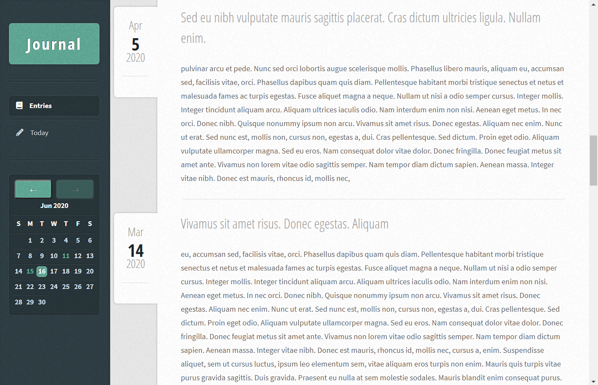
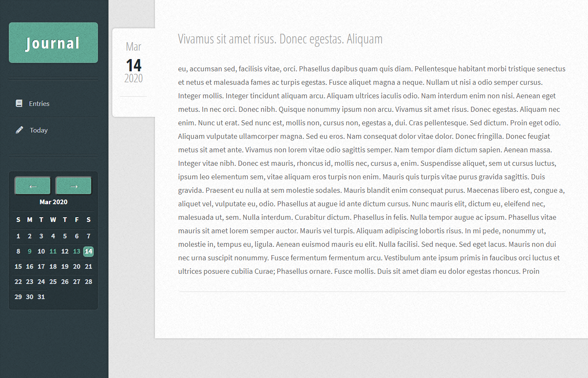
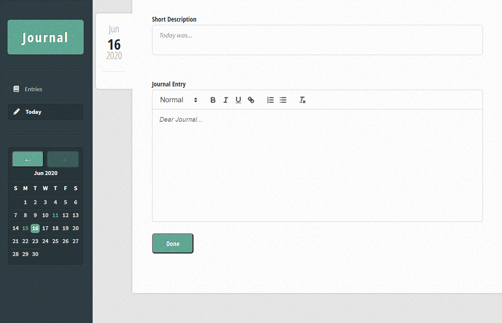

# JournalWeb
A web app for keeping a daily journal.

## Running the app
note: running the app with these directions requires docker to be installed
- Clone this repository
- To load test data in the db uncomment the insert statements in `data/application/init.sql`
- `cd` into the project directory and run `docker-compose up -d`
- Access the app at [localhost:8080](http://localhost:8080)

## Views
The caledar in the sidebar shows which days have journal entries and allows you to go to a specific date by clicking a day on the calendar. Clicking a date without an entry allows you to create one for that date.

### Entries /
Shows all journal entries on an infinitely scrolling page.

### Entry /(Y-m-d)
Shows the journal entry for the requested date.

### Write /write/(Y-m-d)
Write or update a journal entry for the requested date.

